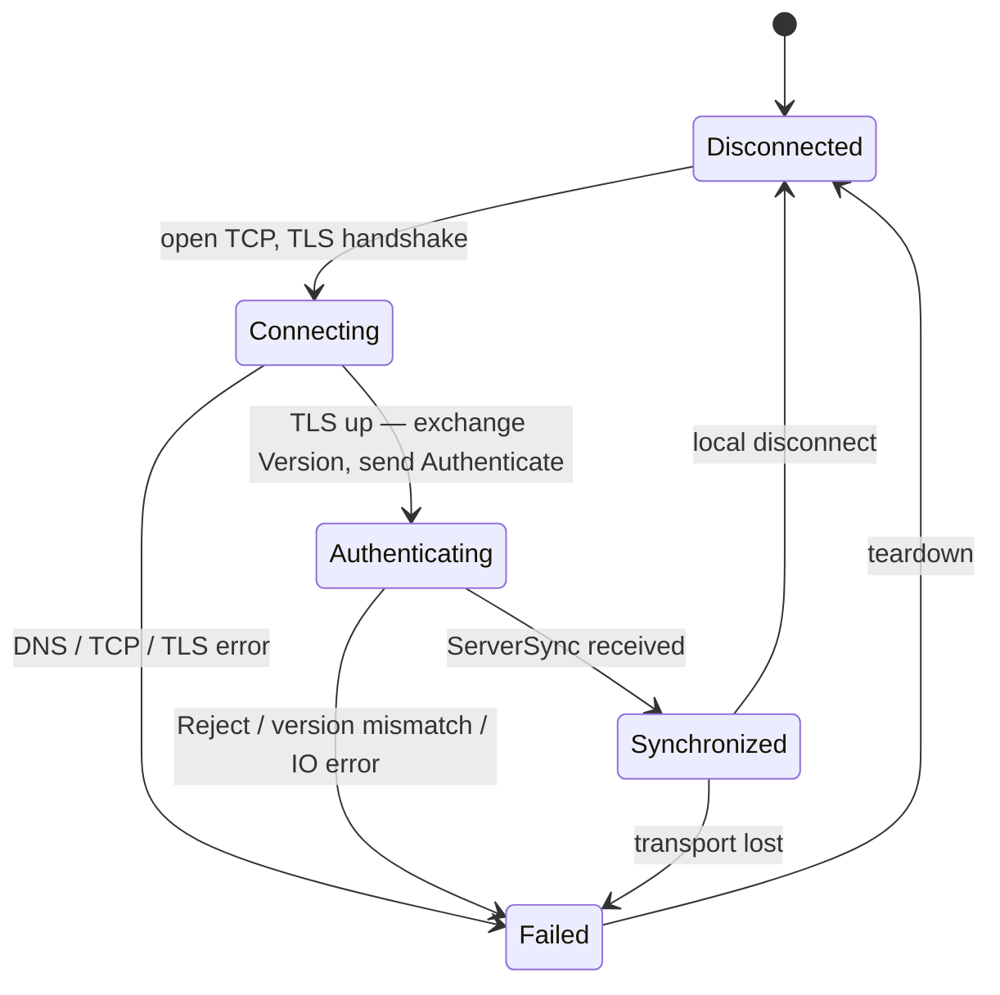
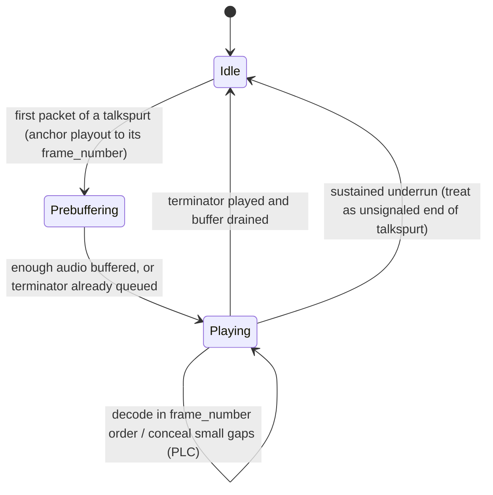

# The Mumble Protocol

A reference for the Mumble VoIP protocol as spoken between any client and server. Mumble
1.5 modernized the voice wire format to protobuf (`MumbleUDP.proto`); this document
describes the modern protocol and notes the legacy format where relevant.

Mumble uses two channels to the same host:port (default 64738):

| Channel | Transport | Encryption | Carries |
|---|---|---|---|
| Control | TCP + TLS | TLS | Version/auth handshake, channel & user state, text, pings, crypt key exchange, tunneled voice fallback |
| Voice | UDP | OCB2-AES128 | Audio packets and UDP pings |

Voice prefers UDP for latency; when UDP is blocked or unreliable, clients fall back to
tunneling the identical voice payloads over the TCP control channel (`UDPTunnel`).

## TCP control channel

Every control message is a length-prefixed protobuf frame, big-endian (network byte order):

```
[u16 type][u32 length][length bytes of protobuf]
```

Type IDs are stable protocol numbers (0–26). The messages that matter for a working
client:

| Message (id) | Direction | Protocol role |
|---|---|---|
| Version (0) | both | Each side announces its protocol version (`version_v2` since 1.5, legacy `version_v1`), release name, and OS |
| UDPTunnel (1) | both | Voice fallback. **Raw payload, not protobuf** — the frame body is the same `[u8 type][protobuf]` plaintext the UDP channel would encrypt (the vendored proto's "Not used" comment refers only to the protobuf message shape) |
| Authenticate (2) | c→s | `username`, optional `password`, ACL `tokens`, codec capability flags (`opus`) |
| Ping (3) | both | Keepalive + RTT; carries client timestamp and UDP crypt statistics (see Pings & statistics) |
| Reject (4) | s→c | Connection refused: wrong version, bad credentials, username in use, server full, … plus a human-readable reason |
| ServerSync (5) | s→c | End of handshake: the client's assigned `session` id, max bandwidth, welcome text, root-channel permissions |
| ChannelRemove (6) / ChannelState (7) | both | Channel tree: create/update/remove channels (server-streamed at login, incremental after) |
| UserRemove (8) / UserState (9) | both | User roster: join/leave/kick and per-user state (channel, mute/deaf, self-mute/deaf, comment, …). Clients send `UserState` to change their own state |
| TextMessage (11) | both | Text chat to users, channels, or channel trees |
| PermissionDenied (12) | s→c | A requested operation was refused (typed reason) |
| CryptSetup (15) | both | UDP encryption key/nonce exchange and resync (below) |
| VoiceTarget (19) | c→s | Registers whisper/shout target ids 1–30 (users, channels, groups) for later use in voice packets |

Everything else (ACL, BanList, QueryUsers, PermissionQuery, CodecVersion, UserStats,
RequestBlob, ServerConfig, SuggestConfig, ContextAction*, PluginDataTransmission) is
optional for basic operation; a client may parse past unneeded types.

TLS: the control connection is TLS from the first byte — contemporary clients and servers
negotiate **TLS 1.3** where both support it, otherwise TLS 1.2; SSLv3 and TLS 1.0/1.1 are
disabled in current software. Servers commonly present self-signed certificates and identify
clients by certificate; clients typically pin the server certificate on first contact
(trust-on-first-use) rather than requiring a CA chain.

## Connection handshake



Sequence: after TLS, both sides send `Version` (the client may send `Version` and
`Authenticate` back-to-back without waiting for the server's `Version`). The server either
sends `Reject` and closes, or streams the session state: `CryptSetup` (UDP keys),
optionally `CodecVersion`/`ServerConfig`, the full channel tree (`ChannelState`*), the
user roster (`UserState`*), and finally `ServerSync`, which marks the client as
synchronized and carries its session id. Voice may flow as soon as `CryptSetup` has been
processed; it does not have to wait for `ServerSync`.

### CryptSetup semantics

`CryptSetup` carries three optional byte fields: `key`, `client_nonce`, `server_nonce`.

- **All three set** (server → client during handshake): initialize OCB2-AES128 with the
  shared key; `client_nonce` is the client's encrypt IV, `server_nonce` its decrypt IV.
- **Empty** (either direction): a resync request — the peer should reply with its current
  transmit nonce.
- **`client_nonce` only** (client → server) / **`server_nonce` only** (server → client):
  the resync answer; the receiver adopts it as its decrypt IV.

## UDP voice channel

Each UDP datagram is one encrypted voice or ping packet with 4 bytes of overhead:

```
[ivLSB][tag0][tag1][tag2][OCB2-AES128 ciphertext]
```

The cipher is **OCB2-AES128** with a 16-byte IV of which only the low byte travels on the
wire; the receiver reconstructs the full IV from its local counter, tolerating a late
window of roughly ±30 packets with wraparound handling and a replay history so duplicated
or reordered datagrams are dropped, while maintaining good/late/lost/resync counters. OCB2
is cryptographically broken (Inoue et al. 2019), and implementations carry a
countermeasure against the known forgery, but it remains wire-required for compatibility.
Decryption failures beyond the late window are the trigger for a `CryptSetup` resync over
TCP. A 4-byte datagram (empty plaintext) is legal.

The decrypted plaintext is:

```
[u8 type][protobuf]      type 0 = MumbleUDP.Audio, 1 = MumbleUDP.Ping
```

**Two wire formats exist historically.** Before 1.5, the voice payload used a bit-packed
header byte (3-bit type, 3-bit target) followed by varint-encoded session/sequence fields
and codec-specific audio framing. Protocol 1.5+ replaced this with the protobuf messages
in `MumbleUDP.proto` shown above; servers translate between the two for mixed populations,
and the two formats are distinguishable on the wire.

### UDPTunnel fallback

When UDP is unusable, the exact same `[u8 type][protobuf]` plaintext is sent as the raw
body of a TCP `UDPTunnel` frame — no OCB2 layer, since TLS already provides
confidentiality. A receiver feeds tunneled payloads into the same voice pipeline as
decrypted UDP datagrams. Servers echo voice back on whichever path the client is using and
treat receipt of UDP data as the signal that the client's UDP path works.

## Voice audio frames

Audio is Opus (48 kHz, VOIP mode). One `MumbleUDP.Audio` message carries one Opus packet
plus routing and stream metadata:

| Field | Meaning |
|---|---|
| `target` / `context` (oneof) | Client→server: `target` — 0 = normal talking, 1–30 = a whisper/shout target previously registered via TCP `VoiceTarget`, 31 = server loopback (echo back to sender). Server→client: `context` — how the audio reached you (0 normal, 1 channel shout, 2 whisper, 3 channel listener) |
| `sender_session` | Session id of the speaking client; always set server→client, unnecessary client→server |
| `frame_number` | Position of this packet's first audio frame in the sender's stream — see below |
| `opus_data` | The Opus packet |
| `positional_data` | Optional `[x, y, z]` speaker position in meters, for positional audio between clients sharing a plugin context |
| `volume_adjustment` | Optional server-determined per-packet gain the client may apply (0 = unset) |
| `is_terminator` | Marks the end of the current audio transmission (talkspurt) |

Packets may carry 10, 20, 40, or 60 ms of audio, and the duration may vary packet to
packet; receivers derive each packet's true span from the Opus TOC byte rather than
assuming a fixed size.

**`frame_number` is a frames-transmitted counter in 10 ms units, not a wall-clock
timestamp.** It advances by 1 per 10 ms of audio actually sent (so +2 for a 20 ms packet)
and **freezes while the sender is silent**: a voice-activity-gated sender stops
transmitting between talkspurts and resumes numbering where it left off. The sample-domain
timestamp of a packet is `frame_number × 480` samples at 48 kHz. Receiver logic that
treats `frame_number` as wall-clock time will misplace audio that follows any silence.

### Talkspurts, silence, and `is_terminator`

A sender using voice activity detection emits audio in **talkspurts** — runs of
consecutive frames — separated by silence during which nothing is transmitted and
`frame_number` does not advance. `is_terminator` is set on the final audio-carrying packet
of a talkspurt, telling receivers the stream is intentionally pausing (as opposed to
packet loss).

A receiver maintains one jitter-buffered playout stream per `sender_session`. The general
shape any Mumble receiver needs:



The key obligation: because `frame_number` freezes across silence, the playout cursor must
**re-anchor at each talkspurt boundary** instead of advancing at wall-clock rate through
the gap — otherwise every packet after a silence arrives "in the past" and gets dropped as
late. `is_terminator` (or, failing that, an underrun timeout) is what marks those
boundaries.

## Pings & statistics

- **TCP `Ping`** — sent by the client on a fixed cadence (conventionally every ~5 s; servers
  time out clients that stop pinging). Carries an opaque client timestamp (echoed by the
  server, yielding control-channel RTT) plus the client's UDP crypt counters
  (good/late/lost/resync), packet totals, and ping averages/variances; the server's reply
  carries its own counters, so both sides can see the UDP path's health in each direction.
- **UDP `Ping`** — an opaque `timestamp` echoed by the server, measuring UDP-path RTT and
  jitter and proving UDP connectivity. Setting `request_extended_information` asks the
  server to fill in its version, current/max user count, and per-user bandwidth cap.

## Relation to this codebase

- Control framing, message ids, and the handshake state machine:
  `app/src/main/java/me/danielstiner/dumble/mumble/protocol/`
- UDP OCB2-AES128 crypto: `app/src/main/java/me/danielstiner/dumble/mumble/net/CryptState.kt`
- TCP/UDP transports, TLS pinning, and UDP↔tunnel selection:
  `app/src/main/java/me/danielstiner/dumble/mumble/net/`
- Voice send/receive, Opus codec, per-speaker jitter-buffered playout:
  `app/src/main/java/me/danielstiner/dumble/mumble/voice/`
- Vendored protocol schemas: `app/src/main/proto/`
- Dumble speaks only the 1.5+ protobuf voice format (no legacy varint framing).
- Talkspurt/silence handling on the receive path is an active work item — see
  `docs/BUGS.md` and `docs/superpowers/adaptive-jitter-buffer-design-notes.md`.

## References

- Protocol schemas (vendored from upstream Mumble, authoritative for message shapes):
  `app/src/main/proto/Mumble.proto`, `app/src/main/proto/MumbleUDP.proto`
- Upstream Mumble documentation and source: <https://github.com/mumble-voip/mumble>
